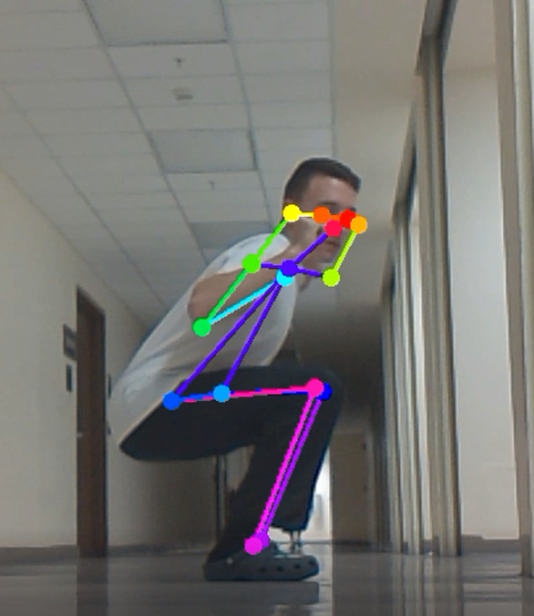
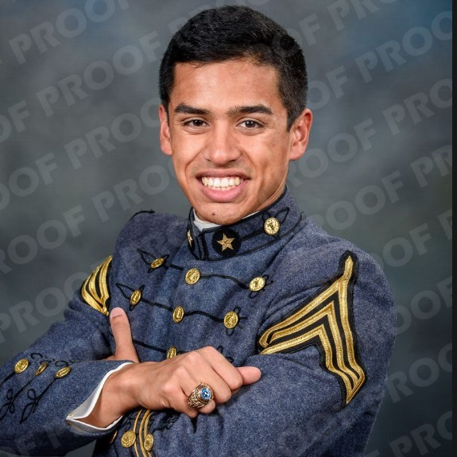
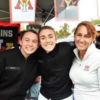

<!-- PROJECT LOGO -->
<br />
<div align="center">
  <a href="s">
    
  </a>

  <h3 align="center">Smart Lifting</h3>

  <p align="center">
    VMI Capstone Team 6 - Samuel Estes, Zachary Farr, Emily Hattman
    <br />
    <a href="https://github.com/primetime728/WeightLiftingCoach"><strong>Explore the docs »</strong></a>
    <br />
    <br />
    <a href="https://github.com/primetime728/WeightLiftingCoach/blob/master/videos/test_video.mp4">View Demo</a>
    ·
    <a href="https://github.com/primetime728/WeightLiftingCoach/issues">Report Bug</a>
    ·
    <a href="mailto:estessj22@mail.vmi.edu">Request Feature</a>
  </p>
</div>


<!-- TABLE OF CONTENTS -->
<details>
  <summary>Table of Contents</summary>
  <ol>
    <li>
      <a href="#about-the-project">About The Project</a>
      <ul>
        <li><a href="#built-with">Built With</a></li>
      </ul>
    </li>
    <li>
      <a href="#getting-started">Getting Started</a>
      <ul>
        <li><a href="#prerequisites">Prerequisites</a></li>
        <li><a href="#installation">Installation</a></li>
      </ul>
    </li>
    <li><a href="#usage">Usage</a></li>
    <li><a href="#roadmap">Roadmap</a></li>
    <li><a href="#contributing">Contributing</a></li>
    <li><a href="#license">License</a></li>
    <li><a href="#contact">Contact</a></li>
    <li><a href="#acknowledgments">Acknowledgments</a></li>
  </ol>
</details>


<!-- ABOUT THE PROJECT -->
## About The Project

[![Product Name Screen Shot][product-screenshot]](https://example.com)

About the project

<p align="right">(<a href="#top">back to top</a>)</p>


### Built With

* [Python](https://www.python.org/)
* [C++](https://www.cplusplus.com/)

<p align="right">(<a href="#top">back to top</a>)</p>


<!-- GETTING STARTED -->
## Getting Started

This project is built using the jetson-inference computer vision libary created by NVIDIA developers.

### Prerequisites

1. Nvidia Jetson Nano 2GB/4GB
2. SD Card 8GB+
3. MIPI CSI Camera

### Installation

_Below is an example of how you can instruct your audience on installing and setting up your app. This template doesn't rely on any external dependencies or services._

## Jetson-inference

1. First you must have installed jetson-inference from the instructions <a href="https://github.com/dusty-nv/jetson-inference/blob/master/docs/building-repo-2.md">here</a> Review the documentation <a href="https://github.com/dusty-nv/jetson-inference">here</a>

2. Clone the repo
   ```sh
   git clone https://github.com/primetime728/WeightLiftingCoach
   ```
3. Run the program using
  ```
  python3 pose_capstone.py
  ```

<p align="right">(<a href="#top">back to top</a>)</p>


<!-- USAGE EXAMPLES -->
## Usage

Screenshots and stuff

<p align="right">(<a href="#top">back to top</a>)</p>


<!-- ROADMAP -->
## Roadmap

- [x] Proof-of-concept
- [x] Sprint 1
- [ ] Sprint 2


<p align="right">(<a href="#top">back to top</a>)</p>


<!-- CONTACT -->
## Team

[](https://www.linkedin.com/in/samuel-estes-b5598122b/)  | [](https://www.linkedin.com/in/zachary-farr-97bb68182/)  | [](https://www.quandl.com/)
---|---|---
[Samuel Estes](https://github.com/primetime728) |[Zach Farr](https://www.linkedin.com/in/zachary-farr-97bb68182/) |[Emily Hattman](https://www.linkedin.com/in/emily-hattman-335050192/)

## License

VMI (https://www.vmi.edu/)

<p align="right">(<a href="#top">back to top</a>)</p>


<!-- ACKNOWLEDGMENTS -->
## Acknowledgments


<p align="right">(<a href="#top">back to top</a>)</p>


<!-- MARKDOWN LINKS & IMAGES -->
<!-- https://www.markdownguide.org/basic-syntax/#reference-style-links -->
[contributors-shield]: https://img.shields.io/github/contributors/othneildrew/Best-README-Template.svg?style=for-the-badge
[contributors-url]: https://github.com/othneildrew/Best-README-Template/graphs/contributors
[forks-shield]: https://img.shields.io/github/forks/othneildrew/Best-README-Template.svg?style=for-the-badge
[forks-url]: https://github.com/othneildrew/Best-README-Template/network/members
[stars-shield]: https://img.shields.io/github/stars/othneildrew/Best-README-Template.svg?style=for-the-badge
[stars-url]: https://github.com/othneildrew/Best-README-Template/stargazers
[issues-shield]: https://img.shields.io/github/issues/othneildrew/Best-README-Template.svg?style=for-the-badge
[issues-url]: https://github.com/othneildrew/Best-README-Template/issues
[license-shield]: https://img.shields.io/github/license/othneildrew/Best-README-Template.svg?style=for-the-badge
[license-url]: https://github.com/othneildrew/Best-README-Template/blob/master/LICENSE.txt
[linkedin-shield]: https://img.shields.io/badge/-LinkedIn-black.svg?style=for-the-badge&logo=linkedin&colorB=555
[linkedin-url]: https://linkedin.com/in/othneildrew
[product-screenshot]: images/screenshot.png
