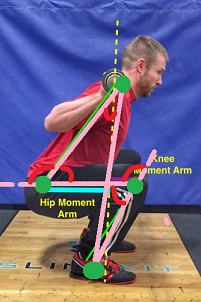
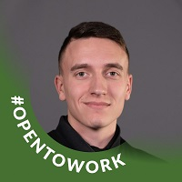

<!-- PROJECT LOGO -->
<br />
<div align="center">
  <a href="s">
    
  </a>

  <h3 align="center">Smart Lifting</h3>

  <p align="center">
    VMI Capstone Team 6 - Samuel Estes, Zachary Farr, Emily Hattman
    <br />
    <a href="https://github.com/primetime728/WeightLiftingCoach"><strong>Explore the docs »</strong></a>
    <br />
    <br />
    <a href="https://youtu.be/5rRMvzmUAKk">View Demo</a>
    ·
    <a href="https://docs.google.com/presentation/d/1YPbgUcGvDK7KMFHtJbIi1gEWjD-amjaJwFG6H_fcRjM/edit?usp=sharing">Presentation Slides</a>
    ·
    <a href="https://github.com/primetime728/WeightLiftingCoach/issues">Report Bug</a>
    ·
    <a href="mailto:estessj22@mail.vmi.edu">Request Feature</a>
  </p>
</div>


<!-- TABLE OF CONTENTS -->
<details>
  <summary>Table of Contents</summary>
  <ol>
    <li>
      <a href="#about-the-project">About The Project</a>
      <ul>
        <li><a href="#built-with">Built With</a></li>
      </ul>
    </li>
    <li>
      <a href="#getting-started">Getting Started</a>
      <ul>
        <li><a href="#prerequisites">Prerequisites</a></li>
        <li><a href="#installation">Installation</a></li>
      </ul>
    </li>
    <li><a href="#usage">Usage</a></li>
    <li><a href="#roadmap">Roadmap</a></li>
    <li><a href="#contributing">Contributing</a></li>
    <li><a href="#license">License</a></li>
    <li><a href="#contact">Contact</a></li>
    <li><a href="#acknowledgments">Acknowledgments</a></li>
  </ol>
</details>


<!-- ABOUT THE PROJECT -->
## About The Project
The Smart Lifting product will aid new and experienced weightlifters by providing insights on proper form and technique. Smart Lifting is an autonomous system that utilizes pose detection and computer vision to record a person in real-time and calculate angle measurements to analyze form. In comparison to other products, Smart Lifting is a compact product that is easily portable. 

Currently uses angle found from joints of the right-side of the body.
<br>
<a href="s">

</a>
<br>
<br>
Using pose detection and computer vision, this software offers real-time feedback on the performance of a user's squat form.
<br>
<br>
<a href="s">

</a>

<p align="right">(<a href="#top">back to top</a>)</p>

### Built With

* [Python](https://www.python.org/)
* [C++](https://www.cplusplus.com/)

<p align="right">(<a href="#top">back to top</a>)</p>


<!-- GETTING STARTED -->
## Getting Started

This project is built using the jetson-inference computer vision libary created by NVIDIA developers.

### Prerequisites

1. Nvidia Jetson Nano 2GB/4GB
2. SD Card 8GB+
3. USB Camera
4. HDMI Screen

### Installation

1. First you must have installed jetson-inference from the instructions <a href="https://github.com/dusty-nv/jetson-inference/blob/master/docs/building-repo-2.md">here</a> Review the documentation <a href="https://github.com/dusty-nv/jetson-inference">here</a>

2. Clone the repo
   ```sh
   git clone https://github.com/primetime728/WeightLiftingCoach
   ```
3. Navigate to the folder
   ```
   cd WeightLiftingCoach
   ```
4. Change the program to executable format
   ```
   chmod u+x capstone.command
   ```   
5. Run the program using
   ```
   ./capstone.command && python3 Smart_Lifting.py
   ```

<p align="right">(<a href="#top">back to top</a>)</p>


<!-- USAGE EXAMPLES -->
## Usage

Screenshots of Application Usage


<p align="right">(<a href="#top">back to top</a>)</p>


<!-- ROADMAP -->
## Roadmap

- [x] Proof-of-concept
- [x] Sprint 1 - Detect Right-side view of squat
- [x] Sprint 2 - Simple GUI
- [x] Sprint 3 - XML Data Management
- [x] Sprint 4 - Rep Count and Squat State Machine
- [x] Sprint 5 - Graph and GUI Deployment
- [x] Sprint 6 - Bug Fixes and Physical Enclosure
- [x] Final Presentation - May 4, 2022

<p align="right">(<a href="#top">back to top</a>)</p>


<!-- CONTACT -->
## Team

[](https://www.linkedin.com/in/samuel-estes-b5598122b/)  | [](https://www.linkedin.com/in/zachary-farr-97bb68182/)  | [](https://www.quandl.com/)
---|---|---
[Samuel Estes](https://github.com/primetime728) |[Zach Farr](https://www.linkedin.com/in/zachary-farr-97bb68182/) |[Emily Hattman](https://www.linkedin.com/in/emily-hattman-335050192/)

## License

VMI (https://www.vmi.edu/)

<p align="right">(<a href="#top">back to top</a>)</p>


<!-- ACKNOWLEDGMENTS -->
## Acknowledgments
Advisors:
<p>Dr. Ramoni Lasisi</p>
<p>BG Smith (USA, Retired)</p>
<p>Dr. Dennis Gracanin</p>

<p align="right">(<a href="#top">back to top</a>)</p>
